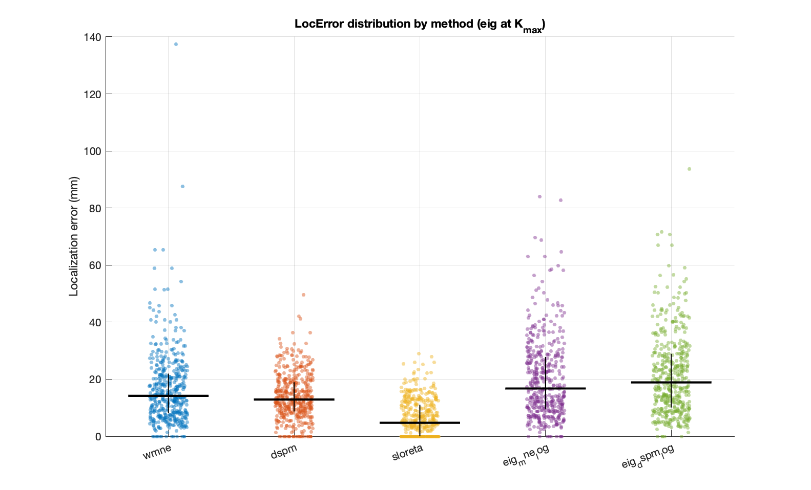
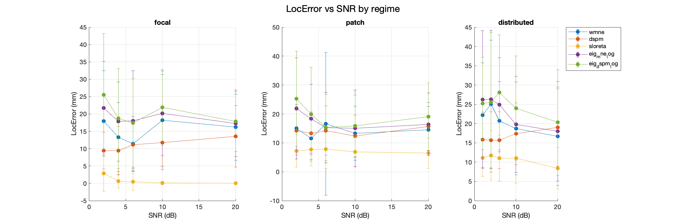
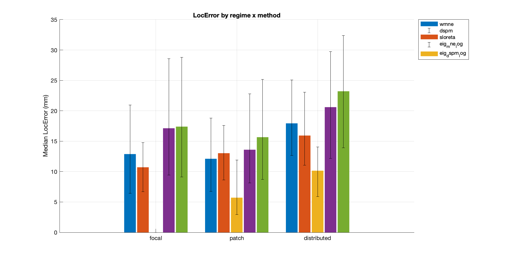
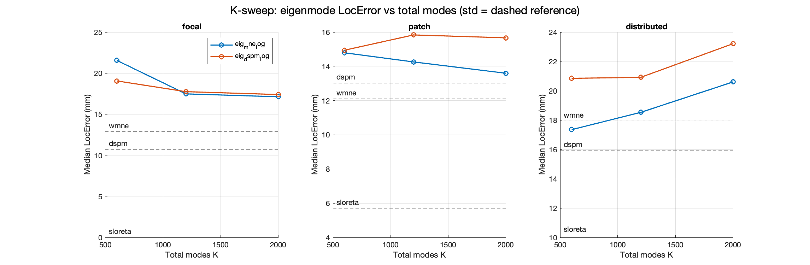
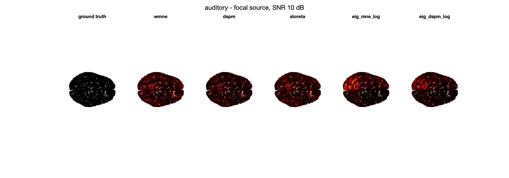

# Eigenmode Source-Mapping Accuracy Benchmark - Report

Anatomies: auditory, neuromag. Methods: wmne, dspm, sloreta, eig_mne_log, eig_dspm_log. Regimes: focal, patch, distributed. SNR (dB): [2 4 6 10 20]. K (total): [600 1200 2000].

## K-sweep (focal, eig\_mne\_log)

| K | median LocError (mm) |
|---|---|
| 600 | 21.56 |
| 1200 | 17.48 |
| 2000 | 17.13 |

Plateau-K (focal): **1200 total modes** (improvement <= 1.0 mm beyond this).

## Competitiveness (paired Wilcoxon, eig vs standard)

| regime | eig | vs | median diff (mm) | p |
|---|---|---|---|---|
| focal | eig_mne_log | wmne | +1.96 | 7.742e-06 |
| focal | eig_mne_log | dspm | +7.13 | 1.054e-08 |
| focal | eig_mne_log | sloreta | +15.63 | 2.168e-25 |
| focal | eig_dspm_log | wmne | +1.75 | 3.366e-07 |
| focal | eig_dspm_log | dspm | +6.94 | 6.208e-10 |
| focal | eig_dspm_log | sloreta | +16.69 | 7.296e-26 |
| patch | eig_mne_log | wmne | +0.30 | 0.008055 |
| patch | eig_mne_log | dspm | +1.57 | 0.05047 |
| patch | eig_mne_log | sloreta | +6.28 | 1.616e-16 |
| patch | eig_dspm_log | wmne | +2.00 | 2.476e-07 |
| patch | eig_dspm_log | dspm | +3.70 | 0.000969 |
| patch | eig_dspm_log | sloreta | +8.83 | 4.233e-19 |
| distributed | eig_mne_log | wmne | +0.08 | 0.1938 |
| distributed | eig_mne_log | dspm | +7.04 | 0.0003401 |
| distributed | eig_mne_log | sloreta | +9.59 | 2.259e-15 |
| distributed | eig_dspm_log | wmne | +2.51 | 0.0002458 |
| distributed | eig_dspm_log | dspm | +8.18 | 1.909e-06 |
| distributed | eig_dspm_log | sloreta | +10.70 | 1.606e-19 |

_Eigenmode is "competitive" where median diff is small and p is not significant, or where the diff favours eig._

## Figures

