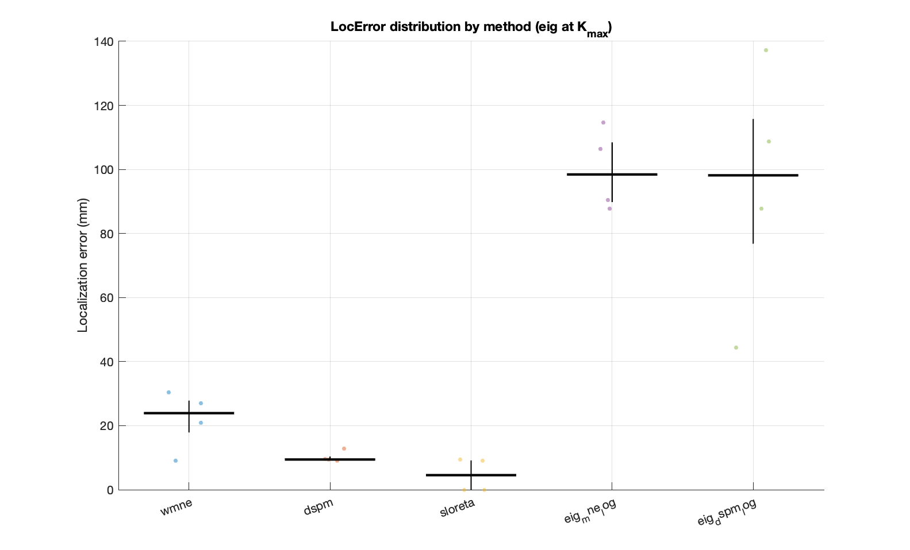
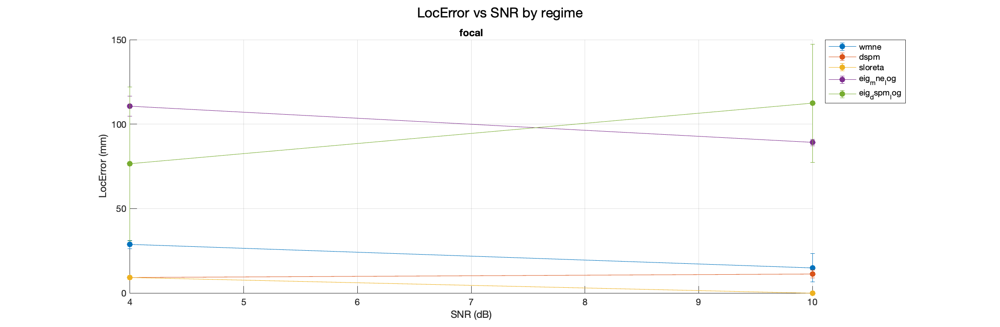
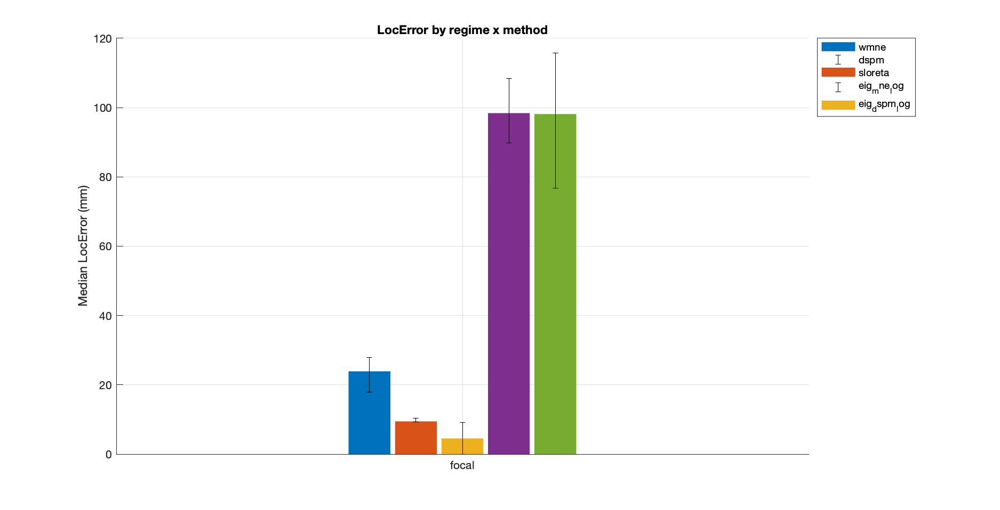
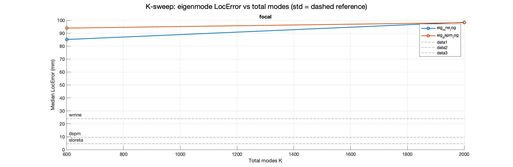
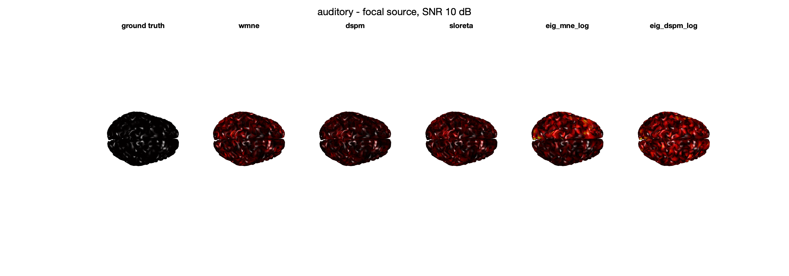

# Eigenmode Source-Mapping Accuracy Benchmark - Report

Anatomies: auditory. Methods: wmne, dspm, sloreta, eig_mne_log, eig_dspm_log. Regimes: focal. SNR (dB): [4 10]. K (total): [600 2000].

## K-sweep (focal, eig\_mne\_log)

| K | median LocError (mm) |
|---|---|
| 600 | 85.13 |
| 2000 | 98.43 |

Plateau-K (focal): **600 total modes** (improvement <= 1.0 mm beyond this).

## Competitiveness (paired Wilcoxon, eig vs standard)

| regime | eig | vs | median diff (mm) | p |
|---|---|---|---|---|
| focal | eig_mne_log | wmne | +80.40 | 0.06789 |
| focal | eig_mne_log | dspm | +87.70 | 0.06789 |
| focal | eig_mne_log | sloreta | +93.89 | 0.06789 |
| focal | eig_dspm_log | wmne | +74.25 | 0.06789 |
| focal | eig_dspm_log | dspm | +88.85 | 0.06789 |
| focal | eig_dspm_log | sloreta | +93.62 | 0.06789 |

_Eigenmode is "competitive" where median diff is small and p is not significant, or where the diff favours eig._

## Figures

